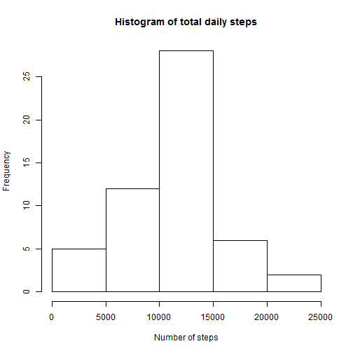
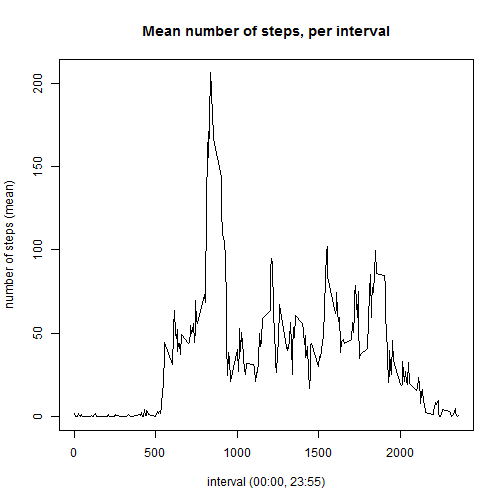
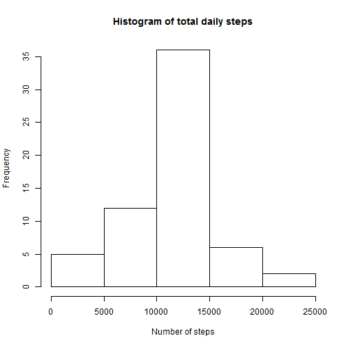
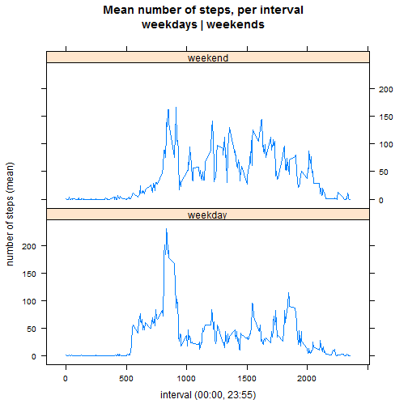

Loading and preprocessing the data

```r
activity <- read.csv("activity.csv", header = T, stringsAsFactors = F)
str(activity)
```

```
## 'data.frame':	17568 obs. of  3 variables:
##  $ steps   : int  NA NA NA NA NA NA NA NA NA NA ...
##  $ date    : chr  "2012-10-01" "2012-10-01" "2012-10-01" "2012-10-01" ...
##  $ interval: int  0 5 10 15 20 25 30 35 40 45 ...
```

```r
# covert "date" strong to Date, format
activity$date <- as.Date(as.character(activity$date), "%Y-%m-%d")
```

What is mean total number of steps taken per day?

```r
total_daily <- aggregate(steps ~ date, data = activity, FUN = sum,
  na.action = na.omit)

with(total_daily, hist(steps, main = "Histogram of total daily steps",
  xlab = "Number of steps"))
```

 

```r
total_median <- median(total_daily$steps)
total_mean <- mean(total_daily$steps)

total_median
```

```
## [1] 10765
```

```r
total_mean
```

```
## [1] 10766.19
```

What is the average daily activity pattern?

```r
time_series <- aggregate(steps ~ interval, data = activity, FUN = mean,
	na.action = na.omit)

plot(time_series$interval, time_series$steps,
  main = "Mean number of steps, per interval",
	xlab = "interval (00:00, 23:55)",
	ylab = "number of steps (mean)",
	type = "l")
```

 

```r
time_series$interval[which.max(time_series$steps)]
```

```
## [1] 835
```

```r
max(time_series$steps)
```

```
## [1] 206.1698
```

Imputing missing values

Missing ("NA") values (step) imputed using the mean value of the relevant interval.


```r
table(is.na(activity$steps))
```

```
## 
## FALSE  TRUE 
## 15264  2304
```

```r
activity.imp <- cbind(activity, time_series$steps)
colnames(activity.imp) <- c("steps","date","interval","steps.imp")


for(i in 1:17568) {
  if(is.na(activity.imp$steps[i])) {
		activity.imp[i,1] <- activity.imp[i,4]
	}
}

activity.imp <- activity.imp[,-4]

imp_daily <- aggregate(steps ~ date, data = activity.imp, FUN = sum)

with(imp_daily, hist(steps, main = "Histogram of total daily steps",
  xlab = "Number of steps"))
```

 

```r
imp_median <- median(imp_daily$steps)
imp_mean <- mean(imp_daily$steps)

imp_median
```

```
## [1] 10766.19
```

```r
imp_mean
```

```
## [1] 10766.19
```

Are there differences in activity patterns between weekdays and weekends?

```r
library(lattice)
```

```
## Warning: package 'lattice' was built under R version 3.1.2
```

```r
library(timeDate)
```

```
## Warning: package 'timeDate' was built under R version 3.1.2
```

```r
activity.imp$daytype <- "" 

for(i in 1:length(activity.imp$date)) {
  if(isWeekday(activity.imp$date[i])) {activity.imp$daytype[i] <- "weekday"}
	if(!isWeekday(activity.imp$date[i])) {activity.imp$daytype[i] <- "weekend"}	
}

imp_time_series <- aggregate(steps ~ interval + daytype, data = activity.imp,
	FUN = mean)

xyplot(steps ~ interval | daytype, imp_time_series, type = "l",
	layout = c(1,2), xlab = "interval (00:00, 23:55)",
	ylab = "number of steps (mean)",
	main = "Mean number of steps, per interval
	weekdays | weekends")
```

```
## Warning in grid.Call(L_textBounds, as.graphicsAnnot(x$label), x$x, x$y, :
## font width unknown for character 0x9
```

```
## Warning in grid.Call(L_textBounds, as.graphicsAnnot(x$label), x$x, x$y, :
## font width unknown for character 0x9
```

```
## Warning in grid.Call.graphics(L_text, as.graphicsAnnot(x$label), x$x, x$y,
## : font width unknown for character 0x9
```

 
